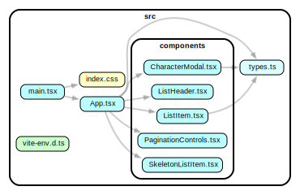

# Game of Thrones Characters

This is a simple React web application that fetches and displays Game of Thrones characters from the [ThronesAPI](https://thronesapi.com/).

#### Visit Character Browser: [Game of Thrones Characters Browser](https://character-browser.netlify.app/)

## Features

-   Displays a paginated table of Game of Thrones characters.
-   Allows sorting by ID and Name columns.
-   Responsive design for different screen sizes.
-   Click on a character to view detailed information in a modal.
-   Skeleton Loading of list items during data fetch

## Installation

1.  Clone the repository:

    ```bash
    git clone https://github.com/karprabha/character-browser
    ```

2.  Navigate to the project directory:
    ```bash
    cd character-browser
    ```
3.  Install dependencies:
    ```bash
    npm install
    ```

## Usage

1.  Run the application:

    ```bash
    npm start
    ```

    The application will be available at http://localhost:5173.

2.  Open your web browser and navigate to the provided URL.

## Project Structure

-   **src/components:** Contains React components used in the application.
-   **src/types:** Defines TypeScript types for the project.
-   **src/App.tsx:** Main application component.
-   **src/main.tsx:** Entry point of the application.

## Dependencies

-   **React:** A JavaScript library for building user interfaces.
-   **TypeScript:** A superset of JavaScript that adds static types.
-   **Tailwind CSS:** A utility-first CSS framework for rapid UI development.

## Dependency Graph



## Credits

-   **ThronesAPI:** https://thronesapi.com/
